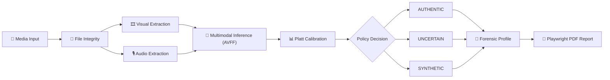

<div align="center">

<pre align="center">
███╗   ███╗███████╗██████╗ ██╗ █████╗ ██████╗ ███╗   ██╗ █████╗       ╔═══╗
████╗ ████║██╔════╝██╔══██╗██║██╔══██╗██╔══██╗████╗  ██║██╔══██╗     ║╲ ╱║
██╔████╔██║█████╗  ██║  ██║██║███████║██║  ██║██╔██╗ ██║███████║     ║ ╳ ║
██║╚██╔╝██║██╔══╝  ██║  ██║██║██╔══██║██║  ██║██║╚██╗██║██╔══██║     ║╱ ╲║
██║ ╚═╝ ██║███████╗██████╔╝██║██║  ██║██████╔╝██║ ╚████║██║  ██║     ╚═══╝
╚═╝     ╚═╝╚══════╝╚═════╝ ╚═╝╚═╝  ╚═╝╚═════╝ ╚═╝  ╚══╝╚═╝  ╚═╝

MEDIA AUTHENTICITY // FORENSIC ANALYSIS

[ SYSTEM ONLINE ]
[ MULTIMODAL ANALYSIS ]
[ AUDIO/VISUAL FUSION ]
[ UNCERTAINTY AWARE ]
</pre>

# 🧬 MediaDNA

### Deepfake Provenance & Multimodal Media Authenticity Analysis

> **[ ENTER THE MEDIADNA FORENSIC LAB ](https://naveenck-10.github.io/MediaDNA/)**

> A multimodal forensic analysis framework for investigating the authenticity of audio-visual media using cross-modal deepfake detection, calibrated decision-making, uncertainty handling, and evidence-oriented reporting.

[](#)
[](#)
[](#)
[](#)
[](#)

</div>

<br>

**Project Status**: Active engineering and research prototype.

**Engineering Status**: End-to-end framework integrated with real-time SSE processing, dynamic UI, and automated PDF forensic reporting via Playwright.

**Model Status**: Currently evaluating the verified `VideoCAVMAEFT` baseline. V22.4 retraining experiments to address specific visual-specialist vulnerabilities are currently active—results pending.

━━━━━━━━━━━━━━━━━━━━━━━━━━━━━━━━━━━━━━━━━━━━━━━━━━

## 📋 Core Capabilities

| Capability | Description |
| :--- | :--- |
| 🎥 **Visual Analysis** | Analyzes spatial-temporal artifacts across uniform video frames using a ViT encoder. |
| 🎙️ **Audio Analysis** | Analyzes acoustic anomalies using a 16kHz log-mel filterbank audio encoder. |
| 🔗 **Cross-Modal Fusion** | Uses `VideoCAVMAEFT` architecture to identify audio-visual desynchronization. |
| 📊 **Calibration** | Employs Platt Scaling (Logistic Regression) on a dedicated CAL split. |
| ⚠️ **Uncertainty** | Explicit 3-state decision policy (Authentic, Uncertain, Synthetic) to prevent forced binary errors. |
| 🔎 **Evidence Analysis** | Extracts spatial gradients, temporal differences, and audio spectral analysis. |
| 📄 **Forensic Reports** | Deterministic PDF generation detailing media metadata, hashes, and model logits. |
| ⚡ **Real-Time Pipeline** | Server-Sent Events (SSE) provide live visibility into 10+ granular backend extraction steps. |

━━━━━━━━━━━━━━━━━━━━━━━━━━━━━━━━━━━━━━━━━━━━━━━━━━

## 🔬 Research Foundation

MediaDNA builds its analytical core upon the **AVFF** family of architectures.

*Reference: Oorloff et al., "AVFF: Audio-Visual Feature Fusion for Video Deepfake Detection," CVPR 2024. [Read the Official Paper](https://openaccess.thecvf.com/content/CVPR2024/papers/Oorloff_AVFF_Audio-Visual_Feature_Fusion_for_Video_Deepfake_Detection_CVPR_2024_paper.pdf)*

> **Important**: MediaDNA does not claim to have invented the core AVFF architecture. Instead, MediaDNA extends an AVFF-based multimodal detector into an end-to-end, evidence-oriented forensic workflow—wrapping raw logits in calibration, uncertainty policies, and reporting structures necessary for decision-support.

━━━━━━━━━━━━━━━━━━━━━━━━━━━━━━━━━━━━━━━━━━━━━━━━━━

## 🧠 Architecture Overview

### System Architecture


### Forensic Pipeline & Real-Time State

The backend exposes exact processing states rather than simulated percentages. This provides true operational visibility:

1. `QUEUED` / `UPLOADING` - Securing file hash.
2. `VALIDATING` - Executing `ffprobe` security constraints.
3. `INSPECTING_MEDIA` - Demuxing tracks.
4. `EXTRACTING_VIDEO` - Extracting 16 uniform spatial frames.
5. `VISUAL_ANALYSIS` - Passing tensors to the Vision Transformer.
6. `EXTRACTING_AUDIO` - Converting to 16kHz mono PCM.
7. `AUDIO_PREPROCESSING` - Computing 128-band Mel-Spectrograms.
8. `AUDIO_ANALYSIS` - Passing tensors to the Audio Encoder.
9. `LATE_FUSION` - Cross-modal attention mapping.
10. `CALIBRATION` - Mapping raw logits to probability.
11. `DECISION` - Applying the 3-state operating threshold.
12. `FORENSIC_EVIDENCE` - Gathering spatial/temporal metadata.
13. `REPORT_GENERATION` - Dispatching the headless Chromium browser.

━━━━━━━━━━━━━━━━━━━━━━━━━━━━━━━━━━━━━━━━━━━━━━━━━━

## 📊 Verified Results

> **Note**: The metrics below represent the performance of the current locked architecture (`best_audio_model.pth`) on the FakeAVCeleb dataset. These values are extracted directly from verified experiment artifacts.

### Development Set Performance (Verified Baseline)
- **ROC-AUC**: 0.8974 *(Threshold-independent ranking)*
- **Balanced Accuracy**: 0.8634
- **MCC**: 0.2355

### Locked Evaluation
At the selected historical operating point on the locked test manifest (2,219 samples):
- **ROC-AUC**: 0.9094
- **Precision**: 0.9775
- **Recall**: 1.0000
- **Specificity**: 0.0000
- **Balanced Accuracy**: 0.5000
- **MCC**: 0.0000

*Why 0% Specificity?*
This highlights a critical lesson in AI forensics. While the model ranks exceptionally well (ROC-AUC 0.9094), the uncalibrated historical threshold was heavily skewed by the massive synthetic class imbalance in the evaluation split, resulting in a collapse of true negatives. This is exactly why MediaDNA implements a dedicated Platt Scaling calibrator and an **Uncertain** zone.

**V22.4 Retraining Experiment — Results Pending.** (Currently executing proper balanced-sampling specialist training).

━━━━━━━━━━━━━━━━━━━━━━━━━━━━━━━━━━━━━━━━━━━━━━━━━━

## ⚖️ Three-State Decision Model

MediaDNA separates the **model signal** from the **final decision**. Instead of forcing every case into a binary label, the calibrated output is interpreted through an explicit operating policy that can return **Authentic**, **Uncertain**, or **Synthetic**.

```text
                    ┌────────────────────┐
                    │    MODEL OUTPUT    │
                    │    Raw AV signal   │
                    └─────────┬──────────┘
                              │
                              ▼
                    ┌────────────────────┐
                    │    CALIBRATION     │
                    │ Calibrated estimate│
                    └─────────┬──────────┘
                              │
                              ▼
                 ┌─────────────────────────┐
                 │     DECISION POLICY     │
                 │ Selected operating      │
                 │ boundaries              │
                 └────────────┬────────────┘
                              │
                 ┌────────────┼────────────┐
                 ▼            ▼            ▼
             AUTHENTIC     UNCERTAIN    SYNTHETIC
```

| State | Interpretation |
| :--- | :--- |
| 🟢 **AUTHENTIC** | The calibrated output falls within the authenticity region defined by the selected operating policy. |
| 🟡 **UNCERTAIN** | The output falls within the policy's abstention region, so the available model evidence does not support a confident binary decision. |
| 🔴 **SYNTHETIC** | The calibrated output crosses the synthetic decision boundary defined by the selected operating policy. |

> **Important:** These are **decision-policy outputs**, not absolute statements of ground truth. The thresholds depend on the calibration procedure and evaluation protocol and should be interpreted alongside the underlying forensic evidence.

**Decision flow:** `Raw Model Signal → Calibration → Decision Policy → Authentic / Uncertain / Synthetic`

━━━━━━━━━━━━━━━━━━━━━━━━━━━━━━━━━━━━━━━━━━━━━━━━━━

## 🛠️ Technical Stack

| Component | Technologies Used |
| :--- | :--- |
| **Frontend** | React 19, Vite, TypeScript, TailwindCSS, Framer Motion |
| **Backend** | Python, FastAPI, Uvicorn |
| **Machine Learning** | PyTorch, `VideoCAVMAEFT` Architecture, `torchaudio` |
| **Media Extraction** | FFmpeg, `ffprobe` |
| **Reporting** | Playwright, Chromium, HTML/CSS |
| **Realtime comms**| Server-Sent Events (SSE) |

━━━━━━━━━━━━━━━━━━━━━━━━━━━━━━━━━━━━━━━━━━━━━━━━━━

## 🧪 Experiments & Failure Analysis

<details>
<summary><b>V22.3 Historical Failure Analysis</b></summary>

During early iterations, the unimodal specialists completely collapsed. Our diagnostic investigations revealed:
- **Class Imbalance**: Training without proper sampling weights caused the models to prioritize the majority class.
- **Truncated Epochs**: A hardcoded 25-batch limit prevented the Vision Transformer from seeing enough diverse data to learn discriminative spatial features.
- **Cross-Modal Dependency**: The architecture inherently relies on Video-Audio Cross Attention. Ripping the modalities apart without compensating via fusion logic led to poor separation.

This failure analysis triggered the **V22.4 Recovery Protocol**, transitioning the system back to the stable multimodal baseline while properly retraining the specialists with full epochs and `WeightedRandomSampler` balancing.
</details>

### What We Learned
- Severe class imbalance can collapse specialist training if unmitigated.
- ROC-AUC and binary operating-point metrics can tell completely divergent stories (e.g., AUC > 0.90 but Specificity = 0).
- Model feature attribution does not equal manipulation localization ground truth.
- True forensic utility requires surfacing uncertainty, not hiding it.

━━━━━━━━━━━━━━━━━━━━━━━━━━━━━━━━━━━━━━━━━━━━━━━━━━

## 🚀 Installation & Usage

### 1. Repository Setup
```bash
git clone https://github.com/NaveenCK-10/MediaDNA.git
cd MediaDNA
```

### 2. Backend Initialization
Ensure `ffmpeg` is installed on your system PATH.
```bash
python -m venv venv
source venv/bin/activate  # Windows: venv\Scripts\activate
pip install -r requirements.txt
pip install torch torchvision torchaudio --index-url https://download.pytorch.org/whl/cu118

# Launch the FastAPI server
python backend/main.py
```
*The backend will boot on `http://127.0.0.1:8000`. The checkpoint will load into VRAM.*

### 3. Frontend Initialization
```bash
cd frontend
npm install
npm run dev
```
*Access the laboratory dashboard at `http://localhost:5173`.*

━━━━━━━━━━━━━━━━━━━━━━━━━━━━━━━━━━━━━━━━━━━━━━━━━━

## 🔌 API Documentation

MediaDNA exposes a RESTful interface over FastAPI:

- `GET /api/health` — Returns system and GPU status.
- `GET /api/model-info` — Returns checkpoint metadata and current active threshold.
- `POST /api/analyze` — Primary inference endpoint. Accepts `multipart/form-data` media.
- `POST /api/analyze-demo` — Executes inference against safe, locked demonstration samples.
- `GET /api/jobs/{job_id}/events` — SSE endpoint for real-time extraction telemetry.
- `POST /api/report/{case_id}` — Triggers Playwright PDF report generation.
- `GET /api/history` — Returns JSON archive of historical analyses.

━━━━━━━━━━━━━━━━━━━━━━━━━━━━━━━━━━━━━━━━━━━━━━━━━━

## 📁 Project Structure

```text
MediaDNA/
├── backend/            # FastAPI, extraction modules, and Playwright reporting
├── frontend/           # React TSX, Framer Motion, SSE consumers
├── scripts/            # Evaluation, repairs, and historical tests
├── notebooks/          # Reconstruction and diagnostic Jupyter environments
├── checkpoints/        # Local storage for .pth PyTorch weights
├── docs/               
│   ├── audits/         # Formal architectural and security markdown audits
│   └── reports/        # V20/V21/V22 legacy evaluation reports
├── V22_4_recovery/     # Active training and threshold validation scripts
├── requirements.txt
└── README.md
```

━━━━━━━━━━━━━━━━━━━━━━━━━━━━━━━━━━━━━━━━━━━━━━━━━━

## 🔬 Reproducibility

- [x] Model Architecture (`src/models/video_cav_mae.py`)
- [x] V14 Best Checkpoint (`best_audio_model.pth` | SHA256 matches audit)
- [x] Preprocessing exactly mimics training augmentations (16 frames, ImageNet norm)
- [x] Train / Dev / Cal / Test split manifests locked.
- [x] Calibration strictly fit on `v22_2_calibration.csv`.
- [x] Threshold explicitly selected via Dev Set, completely isolated from Locked Test.

━━━━━━━━━━━━━━━━━━━━━━━━━━━━━━━━━━━━━━━━━━━━━━━━━━

## ⚠️ Limitations & Disclaimer

**MediaDNA is a research and engineering prototype for media-authenticity analysis.** 
Its outputs, probabilities, and PDF reports should not be treated as definitive proof of authenticity, manipulation, physical provenance, or legal evidence. 

The system relies on statistical pattern recognition which is inherently susceptible to adversarial attacks, severe compression degradation, and out-of-distribution media generation techniques not present in the FakeAVCeleb training dataset.