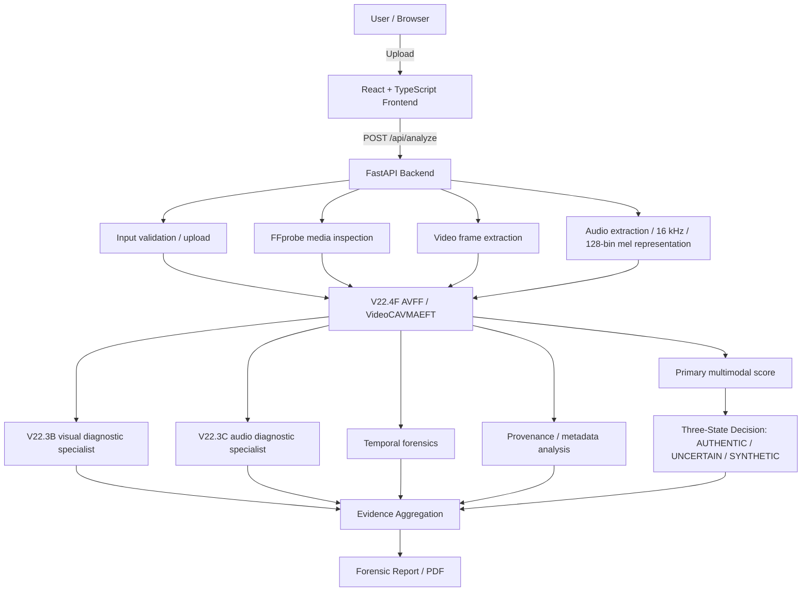

<div align="center">

<table align="center" border="0" cellpadding="12" cellspacing="0">
<tr>
<td align="center">
<pre>
███╗   ███╗███████╗██████╗ ██╗ █████╗ ██████╗ ███╗   ██╗ █████╗
████╗ ████║██╔════╝██╔══██╗██║██╔══██╗██╔══██╗████╗  ██║██╔══██╗
██╔████╔██║█████╗  ██║  ██║██║███████║██║  ██║██╔██╗ ██║███████║
██║╚██╔╝██║██╔══╝  ██║  ██║██║██╔══██║██║  ██║██║╚██╗██║██╔══██║
██║ ╚═╝ ██║███████╗██████╔╝██║██║  ██║██████╔╝██║ ╚████║██║  ██║
╚═╝     ╚═╝╚══════╝╚═════╝ ╚═╝╚═╝  ╚═╝╚═════╝ ╚═╝  ╚══╝╚═╝  ╚═╝
</pre>
</td>
<td align="center">

</td>
</tr>
</table>

<pre align="center">
MEDIA AUTHENTICITY // FORENSIC ANALYSIS

[ SYSTEM ONLINE ]
[ MULTIMODAL ANALYSIS ]
[ AUDIO/VISUAL FUSION ]
[ UNCERTAINTY AWARE ]
</pre>

# 🧬 MediaDNA

### Deepfake Provenance & Multimodal Media Authenticity Analysis

> **[ ENTER THE MEDIADNA FORENSIC LAB ](https://naveenck-10.github.io/MediaDNA/)**

> A multimodal forensic analysis framework for investigating the authenticity of audio-visual media using cross-modal deepfake detection, uncertainty handling, and evidence-oriented reporting.

[](#)
[](#)
[](#)
[](#)
[](#)

</div>

<br>

**Project Status**: Active engineering and research prototype.

**Engineering Status**: End-to-end framework integrated with real-time SSE processing, dynamic UI, and automated PDF forensic reporting via Playwright.

**Model Status**: Currently evaluating the verified `VideoCAVMAEFT` baseline. V22.4 retraining experiments to address specific visual-specialist vulnerabilities are currently active—results pending.

━━━━━━━━━━━━━━━━━━━━━━━━━━━━━━━━━━━━━━━━━━━━━━━━━━

## 📖 Overview

MediaDNA is an end-to-end multimodal forensic workflow. It analyzes media authenticity by processing:
**Media upload → validation → media metadata inspection → visual frame extraction → audio extraction / mel-spectrogram preprocessing → AVFF multimodal inference → diagnostic visual/audio specialist evidence → forensic/temporal/provenance analysis → three-state decision → evidence synthesis → report generation.**

MediaDNA is an applied evaluation and evidence platform built around the AVFF-family detector. It embeds the raw multimodal model in an engineering workflow to support systematic authenticity investigations.

━━━━━━━━━━━━━━━━━━━━━━━━━━━━━━━━━━━━━━━━━━━━━━━━━━

## 🔬 Research Foundation

MediaDNA builds its multimodal detection core on the **AVFF** family of architectures.

*Reference: Oorloff et al., "AVFF: Audio-Visual Feature Fusion for Video Deepfake Detection," CVPR 2024. [Read the Official Paper](https://openaccess.thecvf.com/content/CVPR2024/papers/Oorloff_AVFF_Audio-Visual_Feature_Fusion_for_Video_Deepfake_Detection_CVPR_2024_paper.pdf)*

> **Important**: MediaDNA does not claim to have invented the core AVFF architecture. Instead, MediaDNA extends an AVFF-based multimodal detector into an end-to-end, evidence-oriented forensic workflow—wrapping raw logits in uncertainty policies and reporting structures necessary for decision-support.

━━━━━━━━━━━━━━━━━━━━━━━━━━━━━━━━━━━━━━━━━━━━━━━━━━

## 🧠 Technical Architecture

### System Architecture


> **Note**: Diagnostic specialists (V22.3B, V22.3C) provide supporting evidence when available and are not the primary fusion model.

━━━━━━━━━━━━━━━━━━━━━━━━━━━━━━━━━━━━━━━━━━━━━━━━━━

## 📋 Key Capabilities

- Multimodal audio-visual deepfake analysis
- Video upload and validation (Max 500MB)
- Media stream/container inspection
- FFmpeg / FFprobe preprocessing
- Visual frame sampling
- Audio extraction and mel-spectrogram preprocessing
- Primary AVFF multimodal inference
- Visual specialist diagnostics
- Audio specialist diagnostics
- Temporal forensic signals
- Provenance/metadata signals
- Uncertainty-aware three-state decision policy
- Live SSE analysis progress
- Case/run/asset identifiers
- SHA-256 asset hashing
- Analysis history
- Forensic PDF report generation
- API endpoints
- Frontend dashboard / analysis workflow
- Model information and health checks

━━━━━━━━━━━━━━━━━━━━━━━━━━━━━━━━━━━━━━━━━━━━━━━━━━

## 📦 Model & Checkpoints

| Component | Role | Status | Checkpoint File |
|---|---|---|---|
| **V22.4F** | Primary multimodal AVFF detector | Frozen | `V22_4_recovery/V22_4F_MULTIMODAL_StageB_Ep2.pth` |
| **V22.3B** | Visual specialist diagnostics | Diagnostic | `V22_3B_VISUAL_CHECKPOINT.pth` |
| **V22.3C** | Audio specialist diagnostics | Diagnostic | `V22_3C_AUDIO_CHECKPOINT.pth` |

**Verified SHA-256 Hashes:**
- **Primary:** `6363fa8da584e6f253348f4bc535a4ff033d9718238fb5ec5f53045638d3bdca`
- **Visual:** `b2b592cb4bb2b7bc0581a893e95bd9d9a5c76d69ed9df99e951ef381c36a3c92`
- **Audio:** `cc559590a63b2321ce997b35ead860d9b666e461ab75f9b4e54b0b23cff8b473`

> **Important**: The SHA-256 digest verifies the downloaded asset bytes of the model checkpoint. It does not prove the authenticity or physical provenance of the underlying media being analyzed.

### Official Model Download Instructions

The model bundle is hosted securely on Hugging Face. The large checkpoints are intentionally excluded from the Git repository.

```bash
# Log in to Hugging Face
hf auth login

# Download the primary checkpoint
hf download Naveenck10/MediaDNA-V22.4F V22_4F_MULTIMODAL_StageB_Ep2.pth --local-dir V22_4_recovery

# Download the diagnostic checkpoints
hf download Naveenck10/MediaDNA-V22.4F V22_3B_VISUAL_CHECKPOINT.pth --local-dir V22_4_recovery
hf download Naveenck10/MediaDNA-V22.4F V22_3C_AUDIO_CHECKPOINT.pth --local-dir V22_4_recovery
```

Always verify the SHA-256 hash after download. Cloning the GitHub repository alone does not download the required model weights.

━━━━━━━━━━━━━━━━━━━━━━━━━━━━━━━━━━━━━━━━━━━━━━━━━━

## 🔬 Research / Evaluation Status

MediaDNA is scientifically frozen for final paper/demo preparation. The primary research experiment is **V22.4F**. Model development is not being presented as an ongoing benchmark race. Historical experiments are retained for reproducibility and context, not for cherry-picking.

### LOCKED V22.4F TEST EVALUATION

- **Dataset:** FakeAVCeleb
- **Locked Test Size:** 2,219 samples
- **Class Composition:** 50 real, 2,169 synthetic
- **Frozen Decision Quantity:** RAW SIGMOID DECISION SCORE
- **Frozen Operating Policy:**
  - `< 0.20`: AUTHENTIC
  - `0.20–0.45`: UNCERTAIN
  - `> 0.45`: SYNTHETIC

**Metrics:**
- **ROC-AUC:** 0.7500
- **PR-AUC:** 0.9899
- **Balanced Accuracy (confident):** 0.7686
- **MCC (confident):** 0.1679
- **Precision (confident):** 0.9956
- **Recall (confident):** 0.6621
- **Specificity (confident):** 0.8750
- **F1 (confident):** 0.7953

**Confusion Matrix:**
- **TN:** 42
- **FP:** 6
- **FN:** 697
- **TP:** 1366

**Decision States:**
- **AUTHENTIC:** 739
- **UNCERTAIN:** 108
- **SYNTHETIC:** 1,372
- **Abstention / UNCERTAIN fraction:** 4.9%

**Per-Manipulation Category Recall:**
- RealVideo + RealAudio: 84.0%
- RealVideo + FakeAudio: 98.0%
- FakeVideo + FakeAudio: 95.7%
- FakeVideo + RealAudio: 23.16%

*Interpretation:* The results show strong heterogeneity by manipulation combination. FakeVideo + RealAudio is the weakest category in this locked experiment. This is observational evidence of modality-dependent performance. These are results from the frozen MediaDNA V22.4F experimental protocol and should not be confused with the original AVFF paper's benchmark results.

### Historical Results

**V14 Historical Baseline:**
- **ROC-AUC:** 0.9094
- **Specificity:** 0.0000

The historical V14 operating point exhibited complete true-negative collapse under its uncalibrated thresholding behavior. Older V21 experimental metrics are not valid headline results where their evaluation procedure was not scientifically valid, and historical experiments are archived for traceability only. 

━━━━━━━━━━━━━━━━━━━━━━━━━━━━━━━━━━━━━━━━━━━━━━━━━━

## ⚖️ Three-State Decision Model

| Raw Sigmoid Score | Decision | Interpretation |
|---|---|---|
| `< 0.20` | **AUTHENTIC** | Below the synthetic decision region |
| `0.20–0.45` | **UNCERTAIN** | Abstain rather than force binary classification |
| `> 0.45` | **SYNTHETIC** | Above the synthetic decision region |

> **Crucial Disclaimer:** The V22.4F score is a raw sigmoid model output, not a calibrated probability. The UNCERTAIN state is an operating-policy abstention region, not a statistical confidence guarantee.

━━━━━━━━━━━━━━━━━━━━━━━━━━━━━━━━━━━━━━━━━━━━━━━━━━

## 🔎 Forensic Evidence / Explainability

MediaDNA extracts supporting forensic evidence alongside the primary decision score:
- Model decision score (V22.4F)
- Visual specialist score
- Audio specialist score
- Metadata / media properties
- Temporal signals
- Provenance-related signals
- Model-sensitive regions
- Processing trace
- Asset hash
- Run / case identifiers
- Generated PDF report

> **Scientific Disclaimer:** Model-sensitive regions indicate model response/sensitivity and should not be interpreted as ground-truth manipulated-pixel localization.

━━━━━━━━━━━━━━━━━━━━━━━━━━━━━━━━━━━━━━━━━━━━━━━━━━

## 🚀 Setup & Installation

**Requirements:**
- Python 3.9+
- Node.js 18+
- NVIDIA CUDA GPU strongly recommended (8 GB+ VRAM)
- FFmpeg and FFprobe on PATH

### 1. Repository & Virtual Environment
```bash
git clone https://github.com/NaveenCK-10/MediaDNA.git
cd MediaDNA

python -m venv .venv
# Windows:
.venv\Scripts\Activate.ps1
# Linux/macOS:
source .venv/bin/activate

python -m pip install --upgrade pip
pip install -r requirements.txt
pip install torch torchvision torchaudio --index-url https://download.pytorch.org/whl/cu118
```

### 2. Environment Variables (.env)
Create your `.env` file from the provided example:
```bash
cp .env.example .env
```
Environment variables are used for optional cloud/LLM integrations (e.g. `NVIDIA_API_KEY`). Ensure your credentials are appropriately configured if utilizing extended capabilities. 

### 3. Backend Start
```bash
uvicorn backend.main:app --host 127.0.0.1 --port 8000
```
*Wait for the PyTorch checkpoint to load entirely into VRAM.*

### 4. Frontend Start
```bash
cd frontend
npm install
npm run build
npm run dev
```

━━━━━━━━━━━━━━━━━━━━━━━━━━━━━━━━━━━━━━━━━━━━━━━━━━

## 🌐 Demo / Local Usage

1. Launch both the backend (FastAPI) and frontend (Vite).
2. Open the local dashboard (default: `http://localhost:5173`).
3. Upload an `MP4`, `MOV`, `AVI`, or `MKV` (up to 500 MB).
4. Observe the live Server-Sent Events (SSE) processing trace.
5. Inspect the multimodal result and download the generated PDF report.

━━━━━━━━━━━━━━━━━━━━━━━━━━━━━━━━━━━━━━━━━━━━━━━━━━

## 🔌 API Documentation

MediaDNA exposes a RESTful interface over FastAPI:

- `GET /api/health` — Returns system and GPU status.
- `GET /api/model-info` — Returns checkpoint metadata.
- `POST /api/analyze` — Primary inference endpoint. Accepts `multipart/form-data` media.
- `POST /api/analyze-demo` — Executes inference against safe, local locked demonstration samples.
- `GET /api/jobs/{job_id}/events` — SSE endpoint for real-time extraction telemetry.
- `POST /api/report/{case_id}` — Triggers Playwright PDF report generation.
- `GET /api/report/{case_id}?download=true` — Retrieves the generated report.
- `GET /api/history` — Returns JSON archive of historical analyses.
- `DELETE /api/history` — Clears the history log.

━━━━━━━━━━━━━━━━━━━━━━━━━━━━━━━━━━━━━━━━━━━━━━━━━━

## 📁 Project Structure

```text
MediaDNA/
├── backend/            # FastAPI, extraction modules, and Playwright reporting
│   ├── main.py
│   ├── inference.py
│   └── modules/
├── frontend/           # React TSX, Framer Motion, SSE consumers
├── src/                
│   └── models/         # VideoCAVMAEFT and AVFF core logic
├── V22_4_recovery/     # Active training and threshold validation scripts
├── scripts/            # Evaluation, repairs, and historical tests
├── docs/               # Formal architectural and security markdown audits
├── requirements.txt
└── README.md
```

━━━━━━━━━━━━━━━━━━━━━━━━━━━━━━━━━━━━━━━━━━━━━━━━━━

## 🧪 Reproducibility

- **Primary Checkpoint:** `V22_4F_MULTIMODAL_StageB_Ep2.pth` 
- **SHA-256:** `6363fa8da584e6f253348f4bc535a4ff033d9718238fb5ec5f53045638d3bdca`

**Dataset Requirement:** FakeAVCeleb
- TRAIN: 14,888 samples
- DEV: 2,264 samples
- CAL: 2,195 samples
- LOCKED TEST: 2,219 samples

> **Important:** FakeAVCeleb is NOT bundled with this repository. It must be sourced independently. Exact splits and experimental protocols matter; reproducing the exact numbers requires the same data organization and protocol. Cloning the repository is not sufficient. 

━━━━━━━━━━━━━━━━━━━━━━━━━━━━━━━━━━━━━━━━━━━━━━━━━━

## 🛡️ Security

- The current source code does not intentionally hardcode active credentials. 
- Environment variables (`.env`) are correctly utilized for optional integrations.
- *Notice:* The historical Git history of this repository once contained an exposed NVIDIA credential. Therefore, credential revocation/rotation was executed. The historical Git history should not be considered fully clean.
- This platform is a research prototype, not an enterprise-grade production security application. Uploaded media is size-constrained (500 MB max) by the backend logic.

━━━━━━━━━━━━━━━━━━━━━━━━━━━━━━━━━━━━━━━━━━━━━━━━━━

## ⚠️ Limitations

- **Research Prototype:** MediaDNA is a research and engineering prototype for media-authenticity analysis.
- **Statistical Recognition Risk:** The system relies on statistical pattern recognition which is inherently susceptible to adversarial attacks, severe compression degradation, and out-of-distribution media generation techniques not present in the FakeAVCeleb dataset.
- **Score Semantics:** The raw sigmoid score is not a probability.
- **Uncertainty Policy:** The three-state policy is an abstention region and does not equal calibrated uncertainty.
- **Explainability Bound:** Model-sensitive maps are not ground-truth localization.
- **Hash Boundaries:** Cryptographic hashes track asset integrity in the system, but do not establish overarching media authenticity.
- **Forensic Utility:** Reports generated by MediaDNA are decision-support artifacts and **do not constitute definitive legal proof or exact generator attribution.**

━━━━━━━━━━━━━━━━━━━━━━━━━━━━━━━━━━━━━━━━━━━━━━━━━━

## 📄 Citation

If you build upon this project or use the AVFF-family architecture, please acknowledge the foundational research:

```bibtex
@inproceedings{oorloff2024avff,
  title={AVFF: Audio-Visual Feature Fusion for Video Deepfake Detection},
  author={Oorloff, Trevine and Yasantha, Craig and Mendieta, Matias and Chen, Chen},
  booktitle={Proceedings of the IEEE/CVF Conference on Computer Vision and Pattern Recognition},
  pages={26778--26788},
  year={2024}
}
```