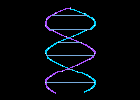

<div align="center">

<table align="center" border="0" cellpadding="12" cellspacing="0">
<tr>
<td align="center">
<pre>
███╗   ███╗███████╗██████╗ ██╗ █████╗ ██████╗ ███╗   ██╗ █████╗
████╗ ████║██╔════╝██╔══██╗██║██╔══██╗██╔══██╗████╗  ██║██╔══██╗
██╔████╔██║█████╗  ██║  ██║██║███████║██║  ██║██╔██╗ ██║███████║
██║╚██╔╝██║██╔══╝  ██║  ██║██║██╔══██║██║  ██║██║╚██╗██║██╔══██║
██║ ╚═╝ ██║███████╗██████╔╝██║██║  ██║██████╔╝██║ ╚████║██║  ██║
╚═╝     ╚═╝╚══════╝╚═════╝ ╚═╝╚═╝  ╚═╝╚═════╝ ╚═╝  ╚══╝╚═╝  ╚═╝
</pre>
</td>
<td align="center">

</td>
</tr>
</table>

<pre align="center">
MEDIA AUTHENTICITY // FORENSIC ANALYSIS

[ SYSTEM ONLINE ]
[ MULTIMODAL ANALYSIS ]
[ AUDIO/VISUAL FUSION ]
[ UNCERTAINTY AWARE ]
</pre>

# 🧬 MediaDNA

### Deepfake Provenance & Multimodal Media Authenticity Analysis

> **[ ENTER THE MEDIADNA FORENSIC LAB ](https://naveenck-10.github.io/MediaDNA/)**

> A multimodal forensic analysis framework for investigating the authenticity of audio-visual media using cross-modal deepfake detection, calibrated decision-making, uncertainty handling, and evidence-oriented reporting.

[](#)
[](#)
[](#)
[](#)
[](#)

</div>

<br>

## 1. MediaDNA Overview

MediaDNA is an end-to-end forensic analysis prototype designed to assess media authenticity. It wraps a cross-modal deepfake detection architecture with a three-state decision policy (Authentic, Uncertain, Synthetic), enabling calibrated decision-making and automated evidence reporting.

## 2. Research Foundation

MediaDNA builds its analytical core upon the **AVFF** family of architectures.

*Reference: Oorloff et al., "AVFF: Audio-Visual Feature Fusion for Video Deepfake Detection," CVPR 2024. [Read the Official Paper](https://openaccess.thecvf.com/content/CVPR2024/papers/Oorloff_AVFF_Audio-Visual_Feature_Fusion_for_Video_Deepfake_Detection_CVPR_2024_paper.pdf)*

> **Important**: MediaDNA does not claim to have invented the core AVFF architecture. Instead, MediaDNA extends an AVFF-based multimodal detector into an end-to-end, evidence-oriented forensic workflow—wrapping raw logits in calibration, uncertainty policies, and reporting structures necessary for decision-support.

## 3. Important Scientific Status

**Project Status**: SCIENTIFICALLY FROZEN.
MediaDNA is frozen for final paper and demonstration preparation. All model development has stopped. The repository reflects the final V22.4F multimodal research experiment.

## 4. Requirements

- **Python**: 3.9+
- **Node.js**: 18+ (for frontend)
- **Hardware**: CUDA-enabled NVIDIA GPU with at least 8GB VRAM is highly recommended. CPU inference is technically possible but impractically slow for the VideoCAVMAEFT multimodal backbone.
- **FFmpeg**: `ffmpeg` and `ffprobe` must be installed and accessible on your system PATH.

## 5. Clone

```bash
git clone https://github.com/NaveenCK-10/MediaDNA.git
cd MediaDNA
```

## 6. Backend Setup

It is highly recommended to use a virtual environment.

**Windows (PowerShell):**
```powershell
python -m venv .venv
.venv\Scripts\Activate.ps1
python -m pip install --upgrade pip
pip install -r requirements.txt
pip install torch torchvision torchaudio --index-url https://download.pytorch.org/whl/cu118
```

**Linux / macOS:**
```bash
python3 -m venv .venv
source .venv/bin/activate
python -m pip install --upgrade pip
pip install -r requirements.txt
pip install torch torchvision torchaudio
```

## 7. Checkpoint Setup

The V22.4F `.pth` checkpoint is intentionally **NOT committed** to Git due to repository size constraints (748MB). `git clone` alone does not provide the runnable model.

1. Obtain the checkpoint `V22_4F_MULTIMODAL_StageB_Ep2.pth` from the project release or contact the repository owner.
2. Place the file exactly at:
   `MediaDNA/V22_4_recovery/V22_4F_MULTIMODAL_StageB_Ep2.pth`
3. Verify the SHA-256 hash:
   `6363fa8da584e6f253348f4bc535a4ff033d9718238fb5ec5f53045638d3bdca`

**Windows PowerShell Verification:**
```powershell
Get-FileHash V22_4_recovery\V22_4F_MULTIMODAL_StageB_Ep2.pth -Algorithm SHA256
```

**Linux / macOS Verification:**
```bash
sha256sum V22_4_recovery/V22_4F_MULTIMODAL_StageB_Ep2.pth
```

## 8. FFmpeg Setup

FFmpeg is not bundled with this repository. You must install it separately.

Ensure `ffmpeg` and `ffprobe` are available on your system `PATH`.

Verify installation:
```bash
ffmpeg -version
ffprobe -version
```

## 9. Environment Variables

MediaDNA can operate basic analysis without any environment variables.

**OPTIONAL variables (for LLM reporting):**
- `NVIDIA_API_KEY`: Required only if you want to use the NVIDIA NIM cloud LLM for dynamic narrative generation. If absent, the backend safely defaults to a deterministic template. Do NOT commit your API key.

## 10. Backend Launch

Open **Terminal 1** and start the FastAPI application:

```bash
uvicorn backend.main:app --host 127.0.0.1 --port 8000
```
*The backend will boot on `http://127.0.0.1:8000` and load the checkpoint into VRAM.*

## 11. Frontend Setup

Open **Terminal 2**, navigate to the frontend directory, and install npm dependencies:

```bash
cd frontend
npm install
npm run build
```

## 12. Frontend Launch

In **Terminal 2**, start the Vite dev server:

```bash
npm run dev
```
*The frontend expects the backend to be running on `http://127.0.0.1:8000`. The Vite server will be available at `http://localhost:5173`.*

## 13. API Smoke Test

With the backend running, you can verify the health and model-info endpoints:

```bash
curl http://127.0.0.1:8000/api/health
curl http://127.0.0.1:8000/api/model-info
```

These should return JSON confirming `status: ok` and listing the active `V22.4F` model configuration.

## 14. Running an Analysis

1. Ensure both the Backend (Terminal 1) and Frontend (Terminal 2) are running.
2. Open `http://localhost:5173` in your browser.
3. Upload a media file (MP4, AVI, WAV).
4. The system will dispatch the analysis, and you can view the live Server-Sent Events (SSE) progress in the UI.

## 15. Demo / Sample Workflow

The repository contains basic integration tests and demonstration endpoints, but does **NOT** bundle the full multi-GB FakeAVCeleb dataset.

If using the `/api/analyze-demo` endpoint, the system will look for specific files (e.g., `test_report_00109.mp4`) in `data_files/`. These must be provided locally for the demo shortcuts to function.

## 16. Reproducing Frozen V22.4F Evaluation

Cloning the repository does not automatically reproduce the locked test. The FakeAVCeleb dataset must be sourced independently.

**Frozen model:**
`V22_4_recovery/V22_4F_MULTIMODAL_StageB_Ep2.pth` (SHA-256: `6363f...`)

**Dataset:**
FakeAVCeleb configured into exact splits:
- TRAIN 14,888
- DEV 2,264
- CAL 2,195
- LOCKED TEST 2,219

**Frozen decision quantity:**
RAW SIGMOID DECISION SCORE

**Frozen operating policy:**
- `< 0.20` → AUTHENTIC
- `0.20 – 0.45` → UNCERTAIN
- `> 0.45` → SYNTHETIC

**Frozen locked-test metrics:**
- ROC-AUC: 0.7500
- PR-AUC: 0.9899
- Balanced Accuracy (confident): 0.7686
- MCC (confident): 0.1679
- Precision (confident): 0.9956
- Recall (confident): 0.6621
- Specificity (confident): 0.8750
- F1 (confident): 0.7953

*Note: FakeVideo + RealAudio recall is documented at 23.16%. The model suffers severe underperformance when visually manipulated media is paired with authentic audio.*

## 17. Project Structure

```text
MediaDNA/
├── backend/            # FastAPI, extraction modules, and Playwright reporting
├── frontend/           # React TSX, Framer Motion, SSE consumers
├── scripts/            # Evaluation, repairs, and historical tests
├── docs/               # Formal architectural and security markdown audits
├── V22_4_recovery/     # Locked metrics, JSON policies, and experiment artifacts
├── requirements.txt    # Python dependency manifest
└── README.md
```

## 18. Scientific Results

The system implements a **Three-State Decision Model** (Authentic / Uncertain / Synthetic) to prevent forced binary errors. The decision score is a raw sigmoid model output and is *not* a calibrated probability.

MediaDNA explicitly separates the V14 historical baseline from the final V22.4F frozen experiment.

**V14 Historical Baseline (Archived Reference)**
- ROC-AUC: 0.9094
- Specificity: 0.0000 (Suffered from complete true-negative collapse due to class imbalance)

**V22.4F Final Frozen Model**
- ROC-AUC: 0.7500
- Specificity (confident): 0.8750 (Recovered via proper balancing and an Uncertain zone)

## 19. Limitations

**MediaDNA is a research and engineering prototype for media-authenticity analysis.**
Its outputs and PDF reports should not be treated as definitive proof of authenticity, manipulation, physical provenance, or legal evidence.

The system relies on statistical pattern recognition which is inherently susceptible to adversarial attacks, severe compression degradation, and out-of-distribution media generation techniques not present in the FakeAVCeleb training dataset.

MediaDNA provides **MODEL-SENSITIVE REGION** mappings and decision scores. It does *not* claim to provide ground-truth manipulation localization, 100% accuracy, guaranteed authenticity, or exact generator attribution.

## 20. Security

- Hardcoded credentials have been removed from the current source. The codebase uses safe `os.getenv` fallbacks.
- Note: A historical NVIDIA credential exposure remains in the Git history and requires external credential revocation/rotation.

## 21. Troubleshooting

- **`ModuleNotFoundError: No module named 'torch'`**: Ensure you activated your `.venv` before running `pip install -r requirements.txt`.
- **FFmpeg not found**: Ensure `ffmpeg` and `ffprobe` are installed and the `bin` directory is added to your Windows/Linux `PATH`.
- **`FileNotFoundError: [Errno 2] No such file or directory: '.../V22_4_recovery/V22_4F_MULTIMODAL_StageB_Ep2.pth'`**: You did not download the required multi-GB checkpoint. Clone alone does not download the `.pth` files.
- **Backend crashes with `RuntimeError: CUDA error: out of memory`**: Your GPU does not have enough VRAM (8GB+ recommended).
- **`ModuleNotFoundError: No module named 'syntheticvideodetector_pb2'`**: A known missing gRPC dependency. However, `backend/modules/nvidia_nim_api.py` has a graceful fallback in the latest freeze, allowing the server to boot regardless.
- **Frontend Vite server not connecting to backend**: Ensure `uvicorn` is running on `127.0.0.1:8000` in a separate terminal.
