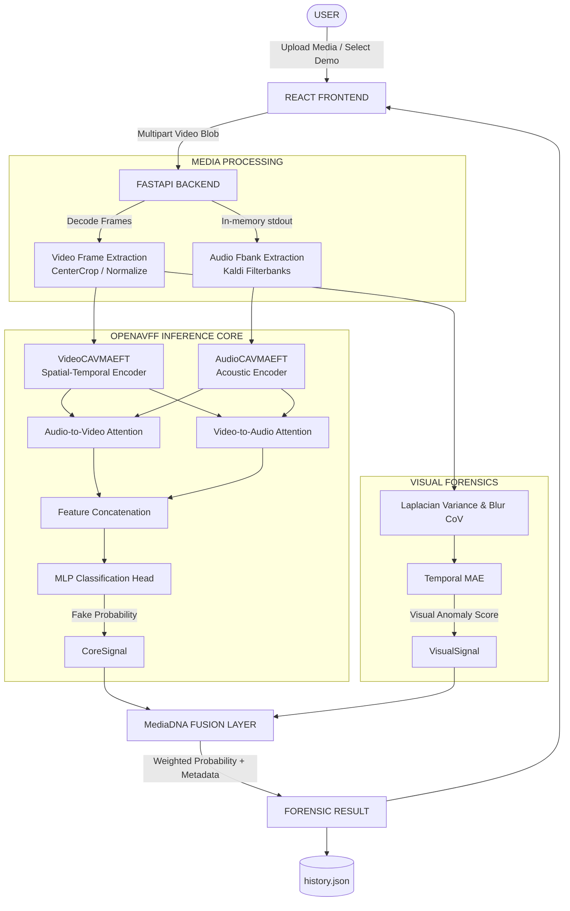

# MediaDNA Architecture

MediaDNA is a digital forensics instrument that utilizes a multimodal deepfake detection core (OpenAVFF) wrapped in a transparent API and analytic frontend. It operates on the principle that deepfakes often introduce subtle desynchronization or artifacting between audio and video streams.

## System Flow

## Component Details

### 1. Media Ingestion
A video file is ingested directly into the backend via a FastAPI endpoint. To ensure optimal performance without disk bottlenecks, the audio stream is instantly ripped out via `ffmpeg` directly into an `io.BytesIO()` memory stream, rather than relying on intermediate `.wav` temporary files.

### 2. Video Processing
16 equidistant frames are extracted uniformly across the video's duration. These frames are resized to 224x224, center-cropped, and normalized using standard ImageNet mean/standard deviations.

### 3. Audio Processing
The memory-buffered audio track is processed by SoundFile and Torchaudio's Kaldi bindings to generate an 80-dimensional log-mel filterbank (fbank). The fbank is linearly interpolated to match exactly 1024 temporal frames required by the model.

### 4. OpenAVFF Model
The underlying AI is the `VideoCAVMAEFT` model.
*   **Visual Encoder**: Extracts spatial-temporal feature maps from the 16 frames.
*   **Audio Encoder**: Extracts acoustic embeddings from the log-mel filterbanks.
*   **A2V / V2A**: A cross-attention mechanism where the audio features attend to the video features (Audio-to-Video) and vice-versa (Video-to-Audio), designed specifically to catch lip-sync failures or mismatched modality environments.
*   **MLP Head**: The concatenated cross-modal features are passed through a Multi-Layer Perceptron that projects into a 2-class logit (Real / Fake).

### 5. Visual Analysis (Explainability)
Because neural networks operate as black boxes, MediaDNA injects a secondary, purely mathematical pipeline:
*   **Laplacian Variance**: Analyzes the high-frequency edge data of the frames to detect synthetic blurring or face-swap seam blending.
*   **Temporal MAE (Mean Absolute Error)**: Measures the pixel-shift between sequential frames to spot artificial frame-drops or glitching generated by temporal models.
These form the `Visual Anomaly Score`.

### 6. MediaDNA Fusion
MediaDNA combines the deep learning prediction with the classical computer vision prediction. The final fusion score currently operates heavily on the OpenAVFF signal (80% weight) but allows the Visual Signal to shift the confidence (20% weight), preventing the model from becoming overly certain when basic spatial physics are broken.

### 7. Assessment & Archival
The resulting probabilities, logits, visual scores, and media metadata (like source software flags extracted via FFprobe) are returned to the user interface. Simultaneously, the result is pushed into the `history.json` archive, enabling persistent retrieval and deep-linking without rerunning the heavy GPU workload.
