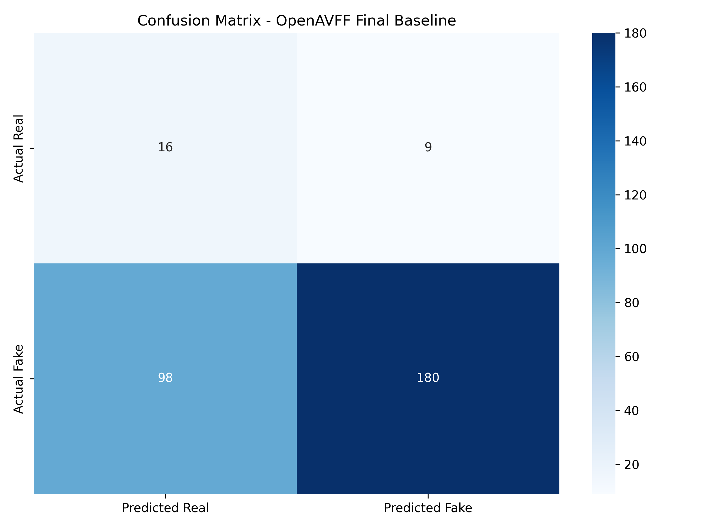

# Final Baseline Evaluation Report - MediaDNA / OpenAVFF

## Overview
- **Model**: VideoCAVMAEFT
- **Checkpoint**: `exp/stage-3-local/models/best_audio_model.pth`
- **Test Set Size**: 303 videos
- **Leakage Prevention**: Videos from train/val splits were explicitly excluded.

## Global Metrics
| Metric | Value |
|--------|-------|
| Accuracy | 0.6469 |
| Precision | 0.9524 |
| Recall | 0.6475 |
| F1 | 0.7709 |
| ROC-AUC | 0.6944 |

## Metrics by Category
| Category | Count | Accuracy | Precision | Recall | F1 | ROC-AUC |
|----------|-------|----------|-----------|--------|----|---------|
| RealVideo-RealAudio | 25 | 0.6400 | 0.0000 | 0.0000 | 0.0000 | N/A |
| RealVideo-FakeAudio | 28 | 0.9643 | 1.0000 | 0.9643 | 0.9818 | N/A |
| FakeVideo-RealAudio | 125 | 0.2720 | 1.0000 | 0.2720 | 0.4277 | N/A |
| FakeVideo-FakeAudio | 125 | 0.9520 | 1.0000 | 0.9520 | 0.9754 | N/A |

## Confusion Matrix

## Conclusion
Based on the evaluation, the current OpenAVFF model has limited performance (Accuracy: 64.7%). It may be used as a baseline for comparison, but significant improvements will be needed in subsequent research stages.
